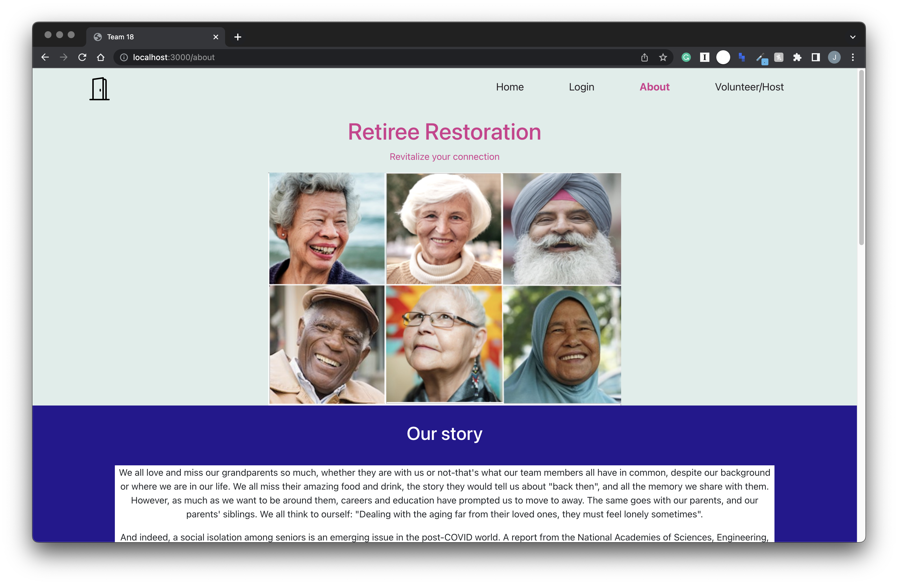
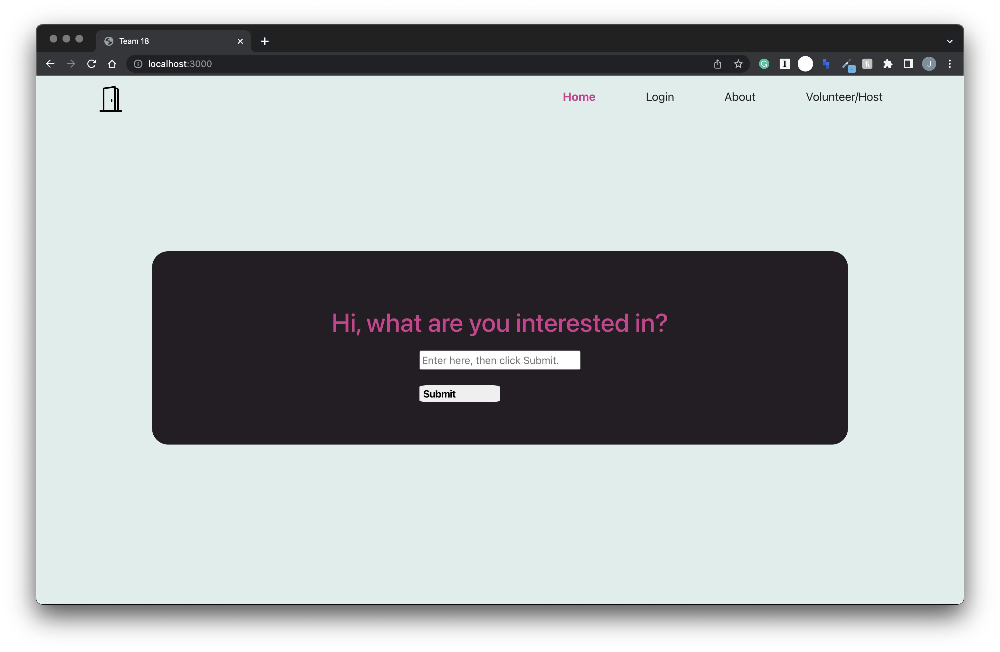
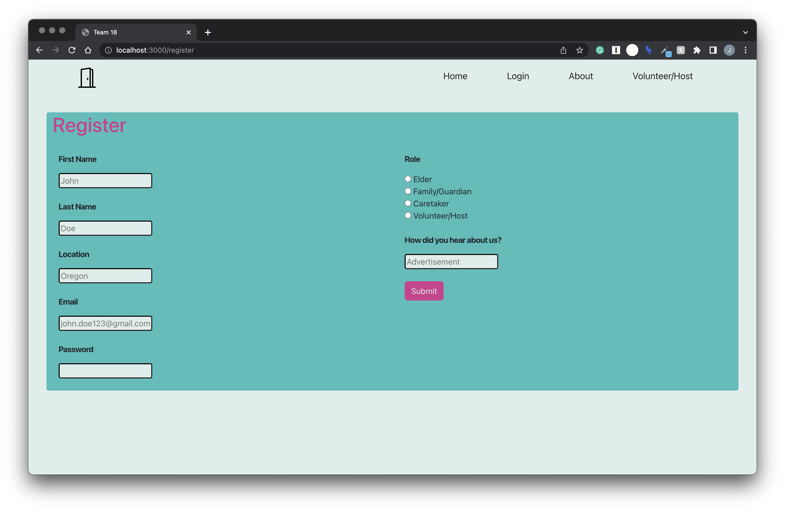
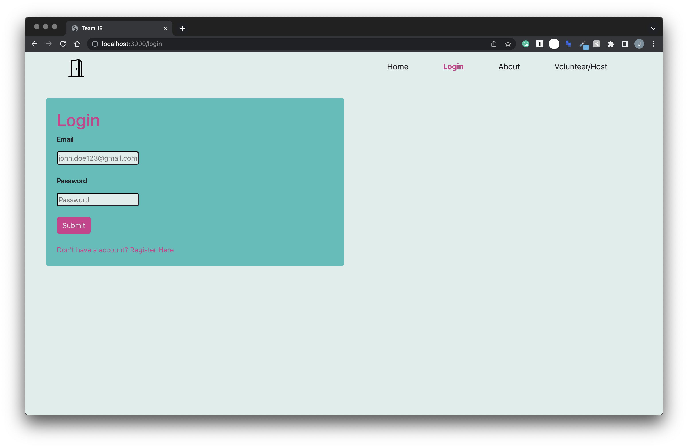
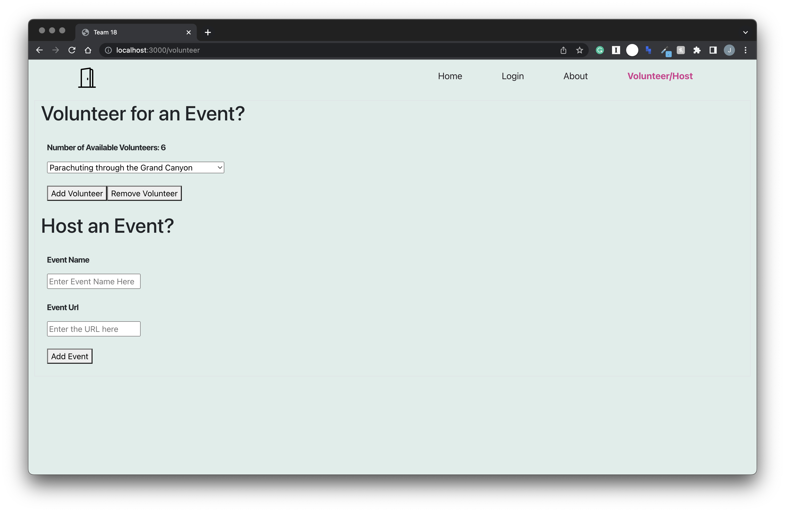

# Retiree Restoration
Due to COVID-19, the elderly have never been more isolated due to both loss in their network and social distancing to keep themselves safe. Social isolation often comes with many mental and physical health detriments, as people are not getting out to be active and enjoy company of others. We want to open up new avenues for socialization so that they can maintain or even expand their network as they age, sharing their wisdom instead of slowly losing people they can interact with. As a solution, we created one-stop web application providing a new avenue for the elderly to build a community and expand their social network as they age

Functionalities:
- Accessible event registration, tailored to interests of each individual
- Community event planning
- Volunteer opportunities to plan and host events
- Guardian/Caretaker assignment based off needs and interests

[Video Presentation](https://drive.google.com/file/d/1tJA1z4VxypM9Q2EaTTQ5qOGFvD3Liv1x/view?usp=sharing) \
[Live Demo](https://team18isthebest.netlify.app/)

## 2022 Hacks for Humanity
Hacks for Humanity is an international in-person and virtual hackathon event. This 3-day hacking event was hosted by Project Humanities at Arizona State University. The event challenges participants to create and to innovate solutions for local and global issues. This year's participant team tracks were Aging and Wellbeing, Civic Engagement, and Environmental Justice. Project's must also embody at least 3 of these 7 Humanity 101 principles: kindness, compassion, integrity, respect, empathy, forgiveness, and self-reflection.

## Contributors
Carson Sidhu \
Jessica Cassidy \
Obi Baratt \
Pranav Bande \
Sienna Luong 

## Build
- React
- Javascript
- HTML/CSS
- Netlify

## Preview

# Getting Started with Create React App
This project was bootstrapped with [Create React App](https://github.com/facebook/create-react-app).

### Available Scripts

In the project directory, you can run:

### `npm start`

Runs the app in the development mode.\
Open [http://localhost:3000](http://localhost:3000) to view it in your browser.

The page will reload when you make changes.\
You may also see any lint errors in the console.

### `npm test`

Launches the test runner in the interactive watch mode.\
See the section about [running tests](https://facebook.github.io/create-react-app/docs/running-tests) for more information.

### `npm run build`

Builds the app for production to the `build` folder.\
It correctly bundles React in production mode and optimizes the build for the best performance.

The build is minified and the filenames include the hashes.\
Your app is ready to be deployed!

See the section about [deployment](https://facebook.github.io/create-react-app/docs/deployment) for more information.

### `npm run eject`

**Note: this is a one-way operation. Once you `eject`, you can't go back!**

If you aren't satisfied with the build tool and configuration choices, you can `eject` at any time. This command will remove the single build dependency from your project.

Instead, it will copy all the configuration files and the transitive dependencies (webpack, Babel, ESLint, etc) right into your project so you have full control over them. All of the commands except `eject` will still work, but they will point to the copied scripts so you can tweak them. At this point you're on your own.

You don't have to ever use `eject`. The curated feature set is suitable for small and middle deployments, and you shouldn't feel obligated to use this feature. However we understand that this tool wouldn't be useful if you couldn't customize it when you are ready for it.

## Learn More

You can learn more in the [Create React App documentation](https://facebook.github.io/create-react-app/docs/getting-started).

To learn React, check out the [React documentation](https://reactjs.org/).

### Code Splitting

This section has moved here: [https://facebook.github.io/create-react-app/docs/code-splitting](https://facebook.github.io/create-react-app/docs/code-splitting)

### Analyzing the Bundle Size

This section has moved here: [https://facebook.github.io/create-react-app/docs/analyzing-the-bundle-size](https://facebook.github.io/create-react-app/docs/analyzing-the-bundle-size)

### Making a Progressive Web App

This section has moved here: [https://facebook.github.io/create-react-app/docs/making-a-progressive-web-app](https://facebook.github.io/create-react-app/docs/making-a-progressive-web-app)

### Advanced Configuration

This section has moved here: [https://facebook.github.io/create-react-app/docs/advanced-configuration](https://facebook.github.io/create-react-app/docs/advanced-configuration)

### Deployment

This section has moved here: [https://facebook.github.io/create-react-app/docs/deployment](https://facebook.github.io/create-react-app/docs/deployment)

### `npm run build` fails to minify

This section has moved here: [https://facebook.github.io/create-react-app/docs/troubleshooting#npm-run-build-fails-to-minify](https://facebook.github.io/create-react-app/docs/troubleshooting#npm-run-build-fails-to-minify)
